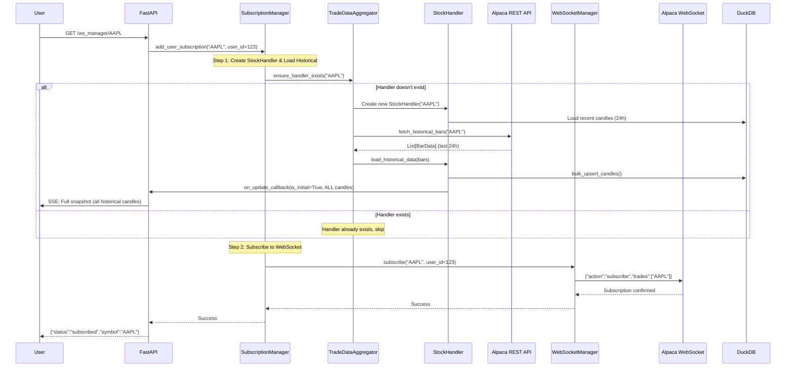
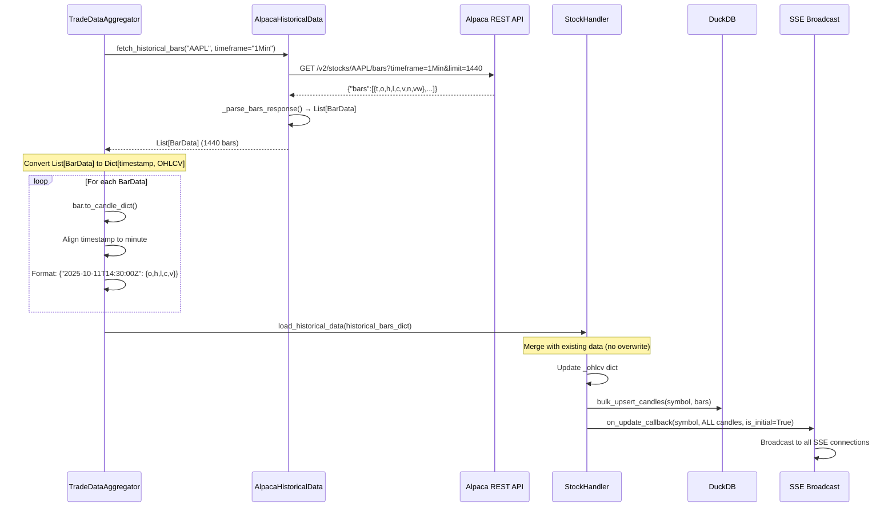
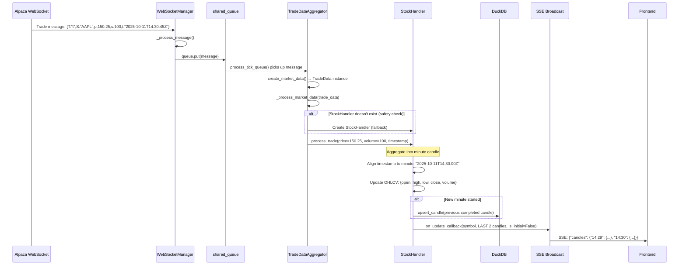
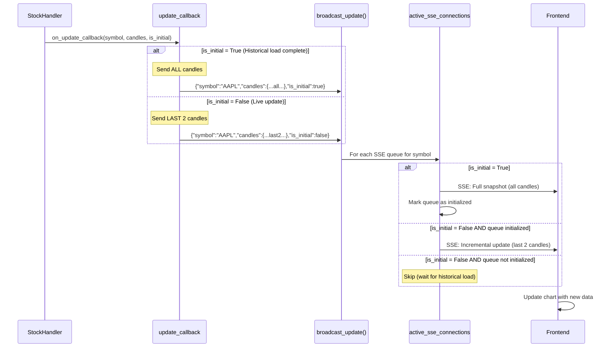

# Subscription and Data Flow Architecture

## Overview

This document describes the complete data flow from user subscription through historical data loading and real-time updates via Server-Sent Events (SSE).

## System Architecture

```
┌─────────────────────────────────────────────────────────────────────┐
│                          User / Frontend                             │
└────────────┬────────────────────────────────────────────┬────────────┘
             │                                             │
             │ GET /ws_manager/{symbol}                   │ SSE: /stream/{symbol}
             │                                             │
┌────────────▼────────────────────────────────────────────▼────────────┐
│                         FastAPI Endpoints                             │
│  - subscribe_to_symbol()                                              │
│  - unsubscribe_to_symbol()                                            │
│  - stream_stock_data() (SSE)                                          │
└────────────┬──────────────────────────────────────────────────────────┘
             │
             │
┌────────────▼──────────────────────────────────────────────────────────┐
│                      SubscriptionManager                               │
│                    (Source of Truth)                                   │
│                                                                        │
│  Responsibilities:                                                     │
│  - Track user subscriptions (user_id → symbols)                       │
│  - Orchestrate subscription flow                                      │
│  - Delegate to WebSocketManager and TradeDataAggregator              │
└───────┬──────────────────────────────────────┬────────────────────────┘
        │                                       │
        │ (1) on_handler_create_callback       │ (2) subscribe_callback
        │                                       │
┌───────▼───────────────────────┐      ┌───────▼────────────────────────┐
│   TradeDataAggregator         │      │   WebSocketManager             │
│                               │      │                                │
│  ensure_handler_exists()      │      │  subscribe()                   │
│  - Create StockHandler        │      │  - Subscribe to Alpaca WS      │
│  - Load from DB               │      │  - Manage WS connection        │
│  - Fetch historical data      │      │  - Handle reconnection         │
└───────┬───────────────────────┘      └───────┬────────────────────────┘
        │                                       │
        │                                       │ Live market data
        │                                       │
        │                              ┌────────▼─────────────────────────┐
        │                              │   Alpaca WebSocket API           │
        │                              │   wss://stream.data.alpaca.com   │
        │                              └────────┬─────────────────────────┘
        │                                       │
        │                                       │ Messages → Queue
        │                                       │
        │                              ┌────────▼─────────────────────────┐
        │                              │   shared_queue                   │
        │                              │   (asyncio.Queue)                │
        │                              └────────┬─────────────────────────┘
        │                                       │
        │                                       │ process_tick_queue()
        │                                       │
        ├───────────────────────────────────────▼───────────────────────────┐
        │                    TradeDataAggregator                            │
        │                    _process_market_data()                         │
        │                                                                   │
        │  - Routes live data to StockHandler                              │
        │  - Safety check: Creates handler if missing                      │
        └───────┬───────────────────────────────────────────────────────────┘
                │
                │
        ┌───────▼──────────────────────────────────────────────────────────┐
        │                    StockHandler                                   │
        │                    (Per-symbol instance)                          │
        │                                                                   │
        │  - Aggregates trades into OHLCV candles (minute-aligned)         │
        │  - Maintains in-memory candle data                               │
        │  - Saves to database (DuckDB)                                    │
        │  - Triggers SSE updates via callback                             │
        └───────┬──────────────────────────────────────────────────────────┘
                │
                │ on_update_callback()
                │
        ┌───────▼──────────────────────────────────────────────────────────┐
        │                    broadcast_update()                             │
        │                    (main.py)                                      │
        │                                                                   │
        │  - Broadcasts to active SSE connections                          │
        │  - Handles is_initial flag (full vs delta updates)              │
        └───────┬──────────────────────────────────────────────────────────┘
                │
                │ SSE messages
                │
        ┌───────▼──────────────────────────────────────────────────────────┐
        │              active_sse_connections                               │
        │              (asyncio.Queue per connection)                       │
        └───────┬──────────────────────────────────────────────────────────┘
                │
                │ event_stream()
                │
        ┌───────▼──────────────────────────────────────────────────────────┐
        │                    Frontend / User                                │
        │              (Receives real-time updates)                         │
        └───────────────────────────────────────────────────────────────────┘
```

---

## Detailed Flow Sequences

### 1. Subscription Flow (User subscribes to a symbol)



---

### 2. Historical Data Loading Flow



---

### 3. Live Data Processing Flow



---

### 4. SSE Update Flow



---

## Key Components

### SubscriptionManager
**Location:** `app/stocks/subscription_manager.py`

**Purpose:** Orchestrates subscriptions as the single source of truth.

**Responsibilities:**
- Track user subscriptions (user_id → set of (symbol, subscription_type) tuples)
- Coordinate between TradeDataAggregator and WebSocketManager
- Ensure StockHandler exists before WebSocket subscription

**Key Methods:**
- `add_user_subscription(user_id, symbol, subscription_type)` - Subscribe user to symbol
- `remove_user_subscription(user_id, symbol, subscription_type)` - Unsubscribe user
- `get_user_subscriptions(user_id)` - Get all subscriptions for a user

**Callbacks:**
- `on_handler_create_callback` → `TradeDataAggregator.ensure_handler_exists()`
- `subscribe_callback` → `WebSocketManager.subscribe()`
- `unsubscribe_callback` → `WebSocketManager.unsubscribe()`

---

### TradeDataAggregator
**Location:** `app/stocks/data_aggregator.py`

**Purpose:** Manage StockHandler instances and process market data.

**Responsibilities:**
- Create and maintain StockHandler instances (one per symbol)
- Load historical data on handler creation
- Route live market data to appropriate StockHandler
- Convert market data formats (BarData, TradeData, QuoteData)

**Key Methods:**
- `ensure_handler_exists(symbol)` - Create handler if needed (idempotent)
- `_load_historical_data(symbol)` - Fetch and load historical bars
- `_process_market_data(input_data)` - Process live market data from queue
- `create_market_data(websocket_data)` - Factory method to create typed data instances

**Data Flow:**
```
WebSocket → Queue → _process_market_data() → StockHandler → SSE Broadcast
```

---

### StockHandler
**Location:** `app/stocks/stockHandler.py`

**Purpose:** Aggregate tick data into OHLCV candles for a single symbol.

**Responsibilities:**
- Aggregate individual trades into minute-aligned OHLCV candles
- Process complete bar data from bar subscriptions
- Maintain in-memory candle data
- Save candles to database
- Trigger SSE updates via callback

**Key Methods:**
- `process_trade(price, volume, timestamp, conditions)` - Aggregate trade into candle
- `process_candle(candle_data)` - Process complete candle (from bar subscription)
- `load_historical_data(historical_bars)` - Load historical data without overwriting
- `_update_candle_data()` - Save to DB and trigger callback

**Update Logic:**
- **New candle:** Save previous completed candle to DB
- **Update existing candle:** Update high/low/close/volume
- **SSE:** Always send last 2 candles (current + previous)

---

### WebSocketManager
**Location:** `app/stocks/websocket_manager.py`

**Purpose:** Manage WebSocket connection to Alpaca and handle subscriptions.

**Responsibilities:**
- Maintain WebSocket connection to Alpaca
- Handle subscription/unsubscription messages
- Manage reconnection logic
- Route messages to output queue
- Track active subscriptions (symbol → subscription_type → users)

**Key Methods:**
- `subscribe(symbol, user_id, subscription_type)` - Subscribe to symbol
- `unsubscribe(symbol, user_id, subscription_type)` - Unsubscribe from symbol
- `start_listening()` - Main message loop with auto-reconnect
- `_process_message(message)` - Parse and queue incoming messages

**Connection States:**
- DISCONNECTED, CONNECTING, CONNECTED, RECONNECTING, SHUTTING_DOWN

---

### AlpacaHistoricalData
**Location:** `app/stocks/historical_data.py`

**Purpose:** Fetch historical bar data from Alpaca REST API.

**Responsibilities:**
- Fetch historical bars via Alpaca REST API
- Parse API response into BarData instances
- Handle timeframes (1Min, 5Min, 15Min, 1Hour, 1Day)
- Default: Last 24 hours of 1-minute bars

**Key Methods:**
- `fetch_historical_bars(symbol, timeframe, start, end, limit)` - Fetch bars
- `_parse_bars_response(data, symbol)` - Parse API response → List[BarData]

**Returns:** `List[BarData]` - Type-safe bar data instances

---

## Data Models

### BarData (websocket_models.py)
```python
@dataclass
class BarData:
    T: str      # message type, always "b"
    S: str      # symbol
    o: float    # open price
    h: float    # high price
    l: float    # low price
    c: float    # close price
    v: int      # volume
    t: str      # RFC-3339 timestamp (start of bar)
    n: int      # number of trades during the bar
    vw: float   # volume weighted average price

    def to_candle_dict(self) -> Dict[str, any]:
        """Convert to candle format for StockHandler"""
        return {
            'open': self.o,
            'high': self.h,
            'low': self.l,
            'close': self.c,
            'volume': self.v,
            'timestamp': self.t,
            'trade_count': self.n,
            'vwap': self.vw
        }
```

### TradeData (websocket_models.py)
```python
@dataclass
class TradeData:
    T: str       # message type, always "t"
    S: str       # symbol
    i: int       # trade ID
    x: str       # exchange code
    p: float     # trade price
    s: int       # trade size
    c: List[str] # trade conditions
    t: str       # RFC-3339 timestamp with nanosecond precision
    z: str       # tape
```

---

## SSE Update Behavior

### Initial Load (is_initial=True)
**Trigger:** Historical data load completes

**Data Sent:** ALL candles (full snapshot)

**Frontend Handling:**
```typescript
if (update.is_initial) {
  // Replace all data
  chartData = update.candles;
}
```

**Example:**
```json
{
  "symbol": "AAPL",
  "candles": {
    "2025-10-10T14:30:00Z": {"open": 150.0, "high": 151.0, ...},
    "2025-10-10T14:31:00Z": {"open": 151.0, "high": 151.5, ...},
    ...
    // 1440 candles (24 hours)
  },
  "is_initial": true,
  "update_timestamp": "2025-10-11T14:30:00Z"
}
```

---

### Incremental Update (is_initial=False)
**Trigger:** Live trade processed or new candle started

**Data Sent:** LAST 2 candles (current + previous)

**Frontend Handling:**
```typescript
if (!update.is_initial) {
  // Merge/upsert candles by timestamp
  Object.assign(chartData, update.candles);
}
```

**Example:**
```json
{
  "symbol": "AAPL",
  "candles": {
    "2025-10-11T14:29:00Z": {"open": 150.0, "high": 151.0, "close": 150.5, ...}, // Completed
    "2025-10-11T14:30:00Z": {"open": 150.5, "high": 150.8, "close": 150.7, ...}  // In progress
  },
  "is_initial": false,
  "update_timestamp": "2025-10-11T14:30:45Z"
}
```

**Why 2 candles?**
- Current candle (being updated continuously)
- Previous candle (just completed, may have missed update)
- Simple, safe, low overhead (~100 bytes)

---

## Error Handling

### Subscription Failure Scenarios

1. **WebSocketManager not connected:**
   - SubscriptionManager continues anyway
   - Historical data still loads
   - WebSocket will retry subscription on reconnect

2. **Historical fetch fails:**
   - Logs error but continues
   - WebSocket subscription still works
   - Live data will start flowing immediately

3. **Database unavailable:**
   - StockHandler continues in-memory aggregation
   - SSE updates continue
   - Data will be saved when DB reconnects

4. **SSE connection drops:**
   - Dead connections removed from broadcast list
   - User must reconnect to resume updates
   - New connection gets full snapshot (is_initial=True)

---

## Performance Considerations

### Memory
- **StockHandler:** One per symbol (~1MB for 24h of minute data)
- **Queue:** Max 500 messages
- **SSE connections:** Max 10 messages per queue

### Throughput
- **Trade processing:** ~10,000 trades/sec (single symbol)
- **SSE updates:** Sent on every trade (can add throttling if needed)
- **Historical fetch:** ~1-2 seconds for 1440 bars

### Database
- **Upsert strategy:**
  - Historical: Bulk upsert on load
  - Live: Upsert previous completed candle (once per minute)
- **Storage:** ~100 bytes per candle (compressed)

---

## Configuration

### Timeframes
Currently hardcoded to 1-minute bars. Can be extended to support:
- 5Min, 15Min, 1Hour, 1Day

### Historical Lookback
Currently fetches last 24 hours (1440 minutes). Can be configured:
```python
# data_aggregator.py:214-216
end_time = datetime.now(timezone.utc)
start_time = end_time - timedelta(days=1)  # Configurable
```

### Subscription Limits
Configured in `AlpacaSubscriptionSettings`:
```python
trades: max_symbols=30
quotes: max_symbols=30
bars: max_symbols=None (unlimited)
```

---

## Testing Checklist

- [ ] Subscribe during market hours → Historical + live data
- [ ] Subscribe during off-hours → Historical data only
- [ ] Subscribe on weekend → Historical data from last Friday
- [ ] Multiple users subscribe to same symbol → Shared handler
- [ ] Unsubscribe when last user leaves → WebSocket unsubscribes
- [ ] SSE connection before subscription → 400 error (expected)
- [ ] SSE connection after subscription → Full snapshot
- [ ] WebSocket disconnects → Auto-reconnect + resubscribe
- [ ] Historical fetch fails → Live data continues
- [ ] Database unavailable → In-memory aggregation continues

---

## Future Enhancements

### Short-term
- [ ] Add configurable historical lookback period
- [ ] Support multiple timeframes (5Min, 15Min, 1Hour)
- [ ] Add SSE update throttling (e.g., max 1 update/second)
- [ ] Market hours detection (skip weekends, holidays)

### Long-term
- [ ] Multi-user isolation (separate data per user subscription)
- [ ] Websocket data compression
- [ ] Historical data pagination (for large timeframes)
- [ ] Real-time metrics (latency, throughput)
- [ ] Caching layer (Redis) for frequently accessed symbols
